# 📈 CodeAlpha - Sales Prediction

[](https://www.python.org/)
[](https://scikit-learn.org/)
[](https://pandas.pydata.org/)
[](https://seaborn.pydata.org/)
[](LICENSE)

An end-to-end Machine Learning, Exploratory Data Analysis (EDA), and Channel Attribution project for predicting product sales based on advertising expenditures across **TV**, **Radio**, and **Newspaper**, developed as part of the **CodeAlpha Data Science Internship**.

---

## 📌 1. Project Overview

Forecasting product sales volume from marketing investments is essential for media planning and return on ad spend (ROAS) optimization. This project implements:
- Ingestion and structured profiling of advertising datasets across multiple media channels.
- Exploratory data analysis (EDA) examining sales distribution normality, pairwise correlations, and channel scatter plots.
- Leakage-free preprocessing pipelines utilizing `StandardScaler` within Scikit-Learn `Pipeline` objects.
- **5-Fold Cross-Validation** benchmarking 3 regression models: **Linear Regression**, **Random Forest Regressor**, and **Gradient Boosting Regressor**.
- Comprehensive test set evaluation measuring **$R^2$ Score**, **Mean Absolute Error (MAE)**, and **Root Mean Squared Error (RMSE)**.
- **Feature Importance & Channel Attribution Analysis**: Identifying the most impactful marketing medium for driving product sales.
- Model serialization via **`joblib`** to `models/best_model.joblib` for real-time inference.

---

## 📊 2. Dataset Description

The dataset is stored in `data/advertising.csv` and contains **200 observations** with **zero missing values**:

| Feature Column | Description | Data Type | Units / Range | Preprocessing |
| :--- | :--- | :---: | :--- | :--- |
| `tv` | Television advertising budget | `float64` | Thousands of dollars ($0.7\text{k} - $296.4\text{k}$) | `StandardScaler` |
| `radio` | Radio advertising budget | `float64` | Thousands of dollars ($0.0\text{k} - $49.6\text{k}$) | `StandardScaler` |
| `newspaper` | Newspaper advertising budget | `float64` | Thousands of dollars ($0.3\text{k} - $114.0\text{k}$) | `StandardScaler` |
| **`sales` (Target)** | **Product sales volume** | `float64` | **Thousands of units ($1.6\text{k} - $27.0\text{k}$)** | **Target Variable** |

---

## 🔬 3. Methodology & Steps Performed

```mermaid
flowchart LR
    A[Raw Advertising Data] --> B[Data Preprocessing & Cleaning]
    B --> C[Exploratory Data Analysis]
    C --> D[80/20 Train/Test Split]
    D --> E[StandardScaler Pipeline]
    E --> F[5-Fold Cross-Validation Benchmarking]
    F --> G[Holdout Test Set Evaluation]
    G --> H[Feature Importance & Channel Attribution]
    H --> I[Model Serialization with Joblib]
    I --> J[Production Sales Inference]
```



### Step 1: Exploratory Data Analysis (EDA)
- **Target Distribution (`results/sales_distribution.png`)**: Sales follow a bell-shaped near-normal distribution ($\mu = 14.02\text{k}, \text{median} = 12.90\text{k}$ units) with zero outliers.
- **Correlation Heatmap (`results/correlation_heatmap.png`)**: Quantifies linear relationship between each ad channel and sales ($r_{TV} = 0.782, r_{Radio} = 0.576, r_{Newspaper} = 0.228$).
- **Channel Scatter Plots (`results/scatter_sales_vs_channels.png`)**: Displays linear regression trendlines demonstrating strong returns on TV investments.

### Step 2: Data Preprocessing & Splitting
- **80/20 Train/Test Split**: 160 training instances, 40 holdout test instances (`random_state=42`).
- **Feature Standardization**: `StandardScaler` ($\mu=0, \sigma=1$) integrated strictly within Scikit-Learn `Pipeline` objects to prevent data leakage during 5-fold cross-validation.

### Step 3: Model Training & 5-Fold Cross-Validation
- Benchmarked 3 diverse regressors on the training set:
  1. **Linear Regression**: Parametric baseline modeling additive channel ROI.
  2. **Random Forest Regressor**: Non-linear bagging ensemble of 100 decision trees.
  3. **Gradient Boosting Regressor**: Sequential boosting ensemble minimizing residual error.

### Step 4: Holdout Test Evaluation & Feature Importance
- Evaluated models across $R^2$, MAE, and RMSE.
- Extracted and visualized Gini/impurity-based feature importances across all models (`results/feature_importance.png`).

---

## 🏆 4. Final Results & Model Comparison

### Model Performance Benchmark Table:

| Rank | Model Architecture | 5-Fold CV $R^2$ Score | 5-Fold CV RMSE (k Units) | Test Set $R^2$ Score (20%) | Test Set MAE (k Units) | Test Set RMSE (k Units) |
| :---: | :--- | :---: | :---: | :---: | :---: | :---: |
| 🥇 | **Gradient Boosting Regressor (Best)** | **0.9671 (±0.013)** | **0.876k** | **0.9831** | **0.618k** | **0.729k** |
| 🥈 | **Random Forest Regressor** | 0.9663 (±0.013) | 0.887k | 0.9813 | 0.621k | 0.769k |
| 🥉 | **Linear Regression** | 0.8703 (±0.072) | 1.676k | 0.8994 | 1.461k | 1.782k |

*Evaluated on holdout test set with 40 samples (80/20 train/test split).*

### 🎯 Champion Model: Gradient Boosting Regressor
- **Why Gradient Boosting Won**: Effectively learned non-linear cross-channel synergy between TV and Radio campaigns, achieving an outstanding **$R^2 = 0.9831$** (explaining 98.31% of sales variation) and the lowest test error (**RMSE: 0.729k units**).
- Serialized to [`models/best_model.joblib`](models/best_model.joblib).

---

## 📢 5. Key Insight: Which Advertising Channel Drives Sales Most?

Visualized in [`results/feature_importance.png`](results/feature_importance.png):

```text
1. 📺 TV Advertising         : ~62% - 84% Importance (Dominant Sales Driver)
2. 📻 Radio Advertising      : ~15% - 35% Importance (Synergy Multiplier)
3. 📰 Newspaper Advertising  : ~1% - 3%   Importance (Negligible Impact)
```

- **Strategic Recommendation**:
  - **TV is the primary demand driver**: Allocating budget to TV yields the highest direct increase in sales volume.
  - **Radio provides cross-media synergy**: Radio reinforces TV campaigns, boosting overall conversion efficiency.
  - **Newspaper should be deprioritized**: Exhibits near-zero incremental return on investment (ROAS).

---

## 📁 6. Project Directory Structure

```text
CodeAlpha_SalesPrediction/
├── .gitignore                             # Python, Jupyter, and editor ignore rules
├── README.md                              # Complete project documentation
├── requirements.txt                       # Project dependencies
├── data/
│   └── advertising.csv                    # Clean dataset (200 records x 5 columns)
├── models/
│   └── best_model.joblib                  # Serialized best model pipeline with scaler
├── notebooks/
│   ├── 01_exploratory_data_analysis.ipynb # Interactive EDA walkthrough
│   └── 02_model_training_and_evaluation.ipynb # Interactive training & CV walkthrough
├── src/
│   ├── __init__.py
│   ├── load_data.py                       # Data loading and feature engineering module
│   ├── eda.py                             # Automated statistical EDA & visual plotting
│   ├── train.py                           # 5-Fold CV, feature importance & serialization
│   └── predict.py                         # Production inference script
└── results/
    ├── eda_summary.txt                    # Statistical profiling report
    ├── sales_distribution.png             # Target sales distribution (histogram + boxplot)
    ├── correlation_heatmap.png            # Pearson correlation heatmap
    ├── scatter_sales_vs_channels.png      # 3-channel regression scatter plots
    ├── pairplot.png                       # Multi-channel pairwise relationship matrix
    ├── channel_spend_contribution.png     # Marketing budget allocation pie chart
    ├── actual_vs_predicted.png            # Actual vs predicted scatter plots
    ├── feature_importance.png             # Advertising channel importance bar charts
    ├── residuals_distribution.png         # Model residual error distributions
    ├── model_comparison.png               # CV vs Test performance comparison charts
    └── model_evaluation_summary.txt       # Training and evaluation logs
```

---

## ⚙️ 7. How to Run the Code

### 1. Set Up Virtual Environment

```bash
cd CodeAlpha_SalesPrediction
python -m venv .venv

# Activate:
# Windows (PowerShell):
.venv\Scripts\Activate.ps1
# Windows (CMD):
.venv\Scripts\activate.bat
# macOS / Linux:
source .venv/bin/activate

# Install dependencies:
pip install -r requirements.txt
```

### 2. Run Exploratory Data Analysis (EDA)

```bash
python src/eda.py
```
> Exports statistical summaries and visual figures (`sales_distribution.png`, `correlation_heatmap.png`, `scatter_sales_vs_channels.png`, `pairplot.png`) to `results/`.

### 3. Train Models, Run 5-Fold CV & Save Best Pipeline

```bash
python src/train.py
```
> Runs 80/20 train/test split, performs 5-Fold CV, plots actual vs predicted and channel importance charts, and saves `models/best_model.joblib`.

### 4. Run Inference on New Campaign Budgets

```bash
python src/predict.py
```
> Loads the champion model and computes estimated sales for custom marketing budgets.

### 5. Interactive Notebooks

```bash
jupyter lab
# or
jupyter notebook
```
- `notebooks/01_exploratory_data_analysis.ipynb`
- `notebooks/02_model_training_and_evaluation.ipynb`

---

## 🎥 8. Video Walkthrough Guide

1. **Introduction**: Problem formulation — predicting product sales based on advertising budgets spent on TV, Radio, and Newspaper.
2. **Data Pipeline (`src/load_data.py`)**: Sanitizing index columns, snake_case conversion, and derived aggregate metrics.
3. **EDA Insights (`src/eda.py`)**:
   - `correlation_heatmap.png`: High linear correlation between TV ($r=0.78$) and Sales.
   - `scatter_sales_vs_channels.png`: Demonstrates linear vs non-linear response curves.
   - `channel_spend_contribution.png`: Overview of channel budget distribution.
4. **Modeling & Preprocessing (`src/train.py`)**:
   - Pipeline encapsulation with `StandardScaler` to prevent data leakage during 5-fold cross-validation.
   - Comparing Linear Regression, Random Forest, and Gradient Boosting.
5. **Results & Attribution (`results/feature_importance.png`, `results/actual_vs_predicted.png`)**:
   - Highlight Gradient Boosting achieving **$R^2 = 0.9831$**.
   - Show that TV represents over 60%+ of total model feature importance.
6. **Live Inference Demo (`src/predict.py`)**:
   - Execute `python src/predict.py` live to show instant sales forecasting.
